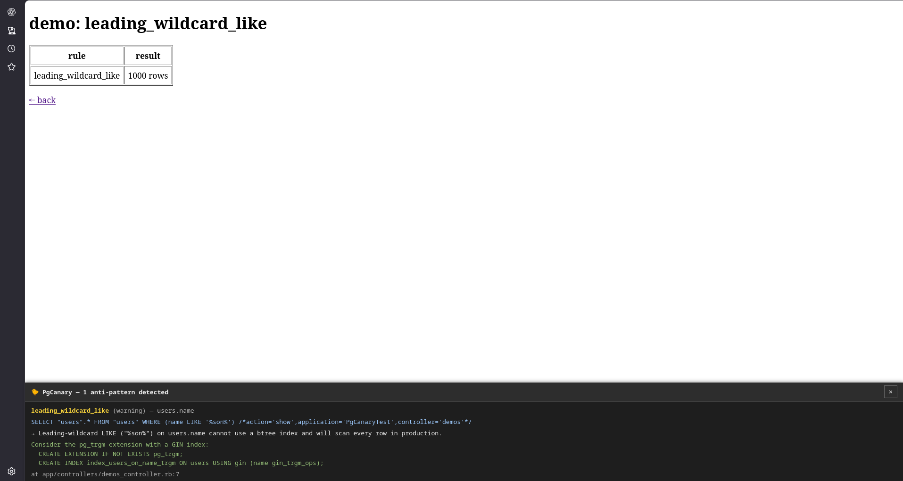

# pg_canary

pg_canary watches the SQL your Rails app executes in development/test and warns about anti-patterns that can become slow queries in production: leading-wildcard `LIKE`s without a trigram index, function-wrapped columns in `WHERE`, `ORDER BY RANDOM()`, `NOT IN (SELECT ...)`, and more. PostgreSQL only.



## Installation

```ruby
# Gemfile
group :development, :test do
  gem "pg_canary"
end
```

## Detection rules

### Enabled by default

| Rule | Detects | Rationale |
|---|---|---|
| `leading_wildcard_like` | `LIKE '%foo'` / `ILIKE '%foo%'` on a column without a pg_trgm GIN/GiST index | A leading wildcard can never use a btree index (having one doesn't help). pg_trgm is the only fix |
| `deep_offset` | `OFFSET` beyond a threshold (default 1000) | Every skipped row is read and discarded; deep pages degrade linearly. Suggests keyset pagination |
| `huge_in_list` | `IN (...)` / `= ANY(...)` with more values than a threshold (default 500) | Expensive to parse/plan, and usually a missing JOIN |
| `correlated_subquery_in_select` | Scalar subquery in the SELECT list referencing the outer table | Executes once per returned row (an N+1 inside a single query). Suggests JOIN + GROUP BY |
| `jsonb_search_without_gin` | jsonb search (`@>`, `?`, …) without a GIN index, or `->>` filtering without a matching expression index | No index can serve these predicates otherwise |
| `array_search_without_gin` | Array search (`@>`, `&&`, `= ANY(column)`) without a GIN index | Same as above, for array columns |
| `function_on_column` | The searched column wrapped in a function (`WHERE lower(email) = ?`) with no matching expression index | A function-wrapped column cannot be an index search key |
| `not_in_subquery` | `NOT IN (SELECT ...)` | A single NULL from the subquery silently empties the result, and the planner optimizes it poorly compared to an anti-join. Suggests rewriting to `NOT EXISTS` |
| `order_by_random` | `ORDER BY RANDOM()` | Reads and sorts every row; cost grows linearly with table size |
| `regex_without_trgm` | `~` / `~*` / `SIMILAR TO` on a column without a trigram index | The regex variant of `leading_wildcard_like` |
| `cartesian_join` | JOIN with no join condition — explicit `CROSS JOIN` between tables, or a comma join never connected in WHERE | The result grows with the product of both tables' row counts |
| `implicit_cast` | Integer column compared with a numeric literal (`age = 1.5`) | The *column* gets implicitly cast to numeric, disabling its index. Restricted to cases provable from the AST alone |

### Disabled by default

| Rule | Detects |
|---|---|
| `unindexed_where` | Equality/range predicate columns in WHERE with no index led by any of them (leftmost-prefix matching on composite indexes is taken into account) |
| `unindexed_order_by_with_limit` | `ORDER BY x LIMIT n` with no index led by x |
| `unindexed_join` | Join-condition columns with no index. Looks at joins that actually ran, so raw-SQL joins are covered too |
| `count_star_without_where` | `SELECT COUNT(*)` without WHERE — MVCC means a full scan. Suggests `reltuples` estimates or counter caches |
| `distinct_with_join` | DISTINCT combined with JOIN, which often hides join fanout. Suggests `EXISTS`. Legitimate uses exist, hence opt-in |
| `union_instead_of_union_all` | `UNION` without ALL — deduplication sorts the whole result. Whether duplicates matter is the author's call |
| `or_across_columns` | OR spanning different columns, which often prevents a single index scan. PostgreSQL can sometimes BitmapOr, hence opt-in |
| `select_star_with_heavy_columns` | `SELECT *` (ActiveRecord's default) on tables with heavy columns (bytea/text/jsonb, configurable) |
| `query_complexity` | More than 8 joins or subquery nesting deeper than 4 (both configurable) — the "spaghetti query" guard |

**Why disabled by default:** the first four depend on production table size — a missing index is not a problem in itself. Lookup tables like prefectures or plans hold a few dozen rows in production too, and a Seq Scan is the right plan for them. The rest depend on the author's intent (deliberate DISTINCT, required deduplication, acceptable payloads). Nothing in the schema or the AST reveals either, so these rules would produce many false positives if enabled by default. Enable the ones that fit your app individually (see [Configuration](#configuration)).

Once opted in, keep false positives down by listing small tables in `config.ignore_tables`.

## Configuration

Everything works with the defaults. To change them, create an initializer:

```ruby
# config/initializers/pg_canary.rb
PgCanary.configure do |config|
  # Where to run (defaults to development)
  config.enabled = Rails.env.development? || Rails.env.test?

  # Excluding tables
  config.ignore_tables += %w[prefectures plans]

  # Per-rule settings
  config.rules.unindexed_where.enabled = true
  config.rules.deep_offset.threshold = 2000
  config.rules.huge_in_list.threshold = 200
  config.rules.query_complexity.max_joins = 12
  config.rules.select_star_with_heavy_columns.heavy_types = %w[bytea jsonb]
end
```

## How it works

pg_canary subscribes to ActiveRecord's `sql.active_record` notifications and analyzes each executed SELECT. Detection is based on the query's AST — parsed with [`pg_query`](https://github.com/pganalyze/pg_query), a binding to PostgreSQL's own parser — combined with schema metadata (index definitions, opclasses, expression indexes, column types) read through ActiveRecord's schema cache. Because analysis happens at query execution time, runtime bind values are visible too — `OFFSET $1` with a bound value of 50000 is still caught, which linters that only see query text cannot do. Detections raised during a request are collected by a Rack middleware, which injects the panel into the HTML response.

## Development

The test suite runs integration tests against a local PostgreSQL (docker-compose included):

```console
$ docker compose up -d --wait
$ bundle install
$ bundle exec rake
```

To test against a different Rails version: `RAILS_VERSION=7.1 bundle install && bundle exec rspec`

## License

The gem is available as open source under the terms of the [MIT License](LICENSE.txt).
